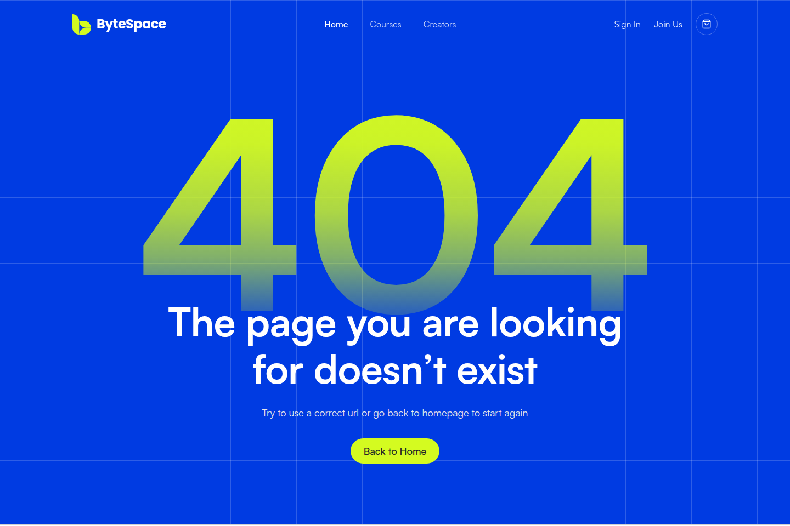
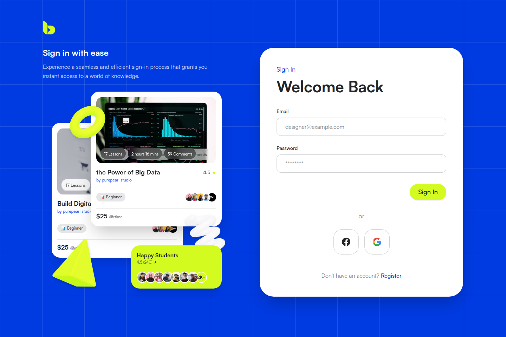

# ByteSpace — Modern E-Learning Platform

[](https://nextjs.org/)
[](https://react.dev/)
[](https://www.typescriptlang.org/)
[](https://tailwindcss.com/)
[](https://motion.dev/)
[](https://byte-space-forntend-git-feature-land-2599c9-sisrafilss-projects.vercel.app/)

A pixel-perfect, fully responsive, and highly interactive e-learning frontend web platform built for the **ByteSpace Assessment** (Jr. Software Engineer - Frontend).

---

## 🌐 Live Preview & Deployments

- **Live Demo (Vercel Preview):** [https://byte-space-forntend-git-feature-land-2599c9-sisrafilss-projects.vercel.app/](https://byte-space-forntend-git-feature-land-2599c9-sisrafilss-projects.vercel.app/)
- **Repository:** [https://github.com/sisrafilss/byte-space-forntend](https://github.com/sisrafilss/byte-space-forntend)
- **Active Branch:** `feature/landing-page`

---

## 📸 Visual Previews & Pages

|                       Landing Page (Home)                        |                       Custom 404 Error Page                       |
| :--------------------------------------------------------------: | :---------------------------------------------------------------: |
|  |  |

|                         Login Page                         |                          Register Page                           |
| :--------------------------------------------------------: | :--------------------------------------------------------------: |
|  |  |

---

## ✨ Key Features & Page Overview

### 1. Landing Page (`/`)

Built with 10 modular, pixel-perfect sections matching the exact Figma specifications:

1. **Header & Navigation:** ByteSpace SVG brand identity, desktop menu links, and an accessible slide-over mobile drawer navigation.
2. **Hero Section:** Signature 120px grid background pattern (12% opacity), 3D geometric ornaments, floating interactive micro-cards (UI/UX Design, Learning Progress 55%, Happy Students rating), and a responsive course search input.
3. **Partner Logos Bar:** Partner brand showcase with high-DPI SVG vectors, styled for responsive viewing across screens.
4. **Featured Categories:** 6 curated category cards (Design, Development, IT & Software, Business, Marketing, Photography) with custom icons and hover transitions.
5. **Course Catalog & Filter Tabs:** Multi-tier category pill filters (Featured, Web Dev, UI/UX, Data Science, etc.) with responsive grid displaying 6 course cards featuring instructors, ratings, duration, and lifetime pricing.
6. **Professional Growth Showcase:** Split section featuring live growth statistics (12K+ Students, 70+ Courses, 16 Creators) with composite floating UI widgets.
7. **Course Management Showcase:** Creator dashboard preview featuring revenue metrics ($120.29 / $1,200.38 YTD) and benefit checklists.
8. **Creator CTA Banner:** High-contrast dark banner with vibrant lime & cyan 3D geometric shapes encouraging instructors to join.
9. **Testimonials Section:** Verified student and creator testimonial cards with avatars, roles, and star ratings.
10. **Footer:** Comprehensive footer with newsletter subscription, platform and browse links, copyright bar, and legal disclosures.

### 2. Authentication Suite (`/login` & `/register`) — Extra Credit

- **Shared Auth Layout (`(auth)/layout.tsx`):** Branded split-screen experience with primary blue background, 120px grid, 3D geometric decorations, and floating rating badges on desktop.
- **Login Page (`/login`):** Email & password inputs, social auth buttons (Google & Facebook), and seamless link to registration.
- **Register Page (`/register`):** Full name, email, and password form fields with client-side state handling and toggle links.
- **Mobile Responsive:** Fluid single-column card layout on smaller viewports with full accessibility.

### 3. Custom 404 Page (`/not-found`)

- Exact Figma design fidelity featuring the towering gradient "404" header (`#00249A` to transparent fade).
- Figma 120px grid background overlay.
- Clear error explanation, heading hierarchy, and primary "Back to Home" call-to-action button.

### 4. GPU-Accelerated Animations (`motion`)

- Built using **Motion** (Framer Motion engine for React 19).
- Reusable animation primitives in `src/components/ui/motion/`:
  - `FadeIn`: Directional fade-in and slide animations with configurable duration and stagger delays.
  - `FloatWrapper`: Gentle floating ambient animations for decorative 3D shapes and floating cards (60–120 FPS GPU-accelerated transforms).
  - `StaggerContainer`: Sequential entrance effects for grid items and category cards.
- **Accessibility:** Fully honors user system settings with `prefers-reduced-motion` fallbacks.

---

## 🛠️ Tech Stack & Design System

| Technology       | Version             | Purpose                                                                |
| :--------------- | :------------------ | :--------------------------------------------------------------------- |
| **Next.js**      | `16.0` (App Router) | React framework with Server Components & optimized asset pipelines     |
| **React**        | `19.0`              | Latest React engine with concurrent rendering                          |
| **TypeScript**   | `5.0+`              | End-to-end type safety across components and utilities                 |
| **Tailwind CSS** | `v4`                | High-performance CSS engine using modern CSS variables & design tokens |
| **Motion**       | `13.4`              | Smooth declarative animations and micro-interactions                   |
| **Lucide React** | `0.544`             | Crisp, scalable UI icons                                               |
| **pnpm**         | `Latest`            | Fast, disk-space efficient package manager                             |

### Design Tokens & Typography

- **Primary Color:** `#0445FF` (`--primary-800`)
- **Secondary / Accent:** `#D4FB20` (`--secondary-400` Neon Lime)
- **Typography:**
  - Headings: `Poppins` (Bold, SemiBold, Medium)
  - Body & UI: `Satoshi` & `Inter` fallback

---

## 📁 Project Architecture

```text
byte-space/
├── public/
│   └── assets/
│       ├── svg/                  # Scalable brand icons & logos
│       ├── images/               # Course thumbnails, avatars & 3D ornaments
│       └── mockups/              # High-res design comparison snapshots
├── src/
│   ├── app/                      # Next.js App Router
│   │   ├── (auth)/               # Auth route group
│   │   │   ├── layout.tsx        # Shared blue branded auth layout
│   │   │   ├── login/page.tsx    # Sign In view
│   │   │   └── register/page.tsx # Sign Up view
│   │   ├── layout.tsx            # Root layout with fonts & metadata
│   │   ├── not-found.tsx         # Custom 404 error page
│   │   ├── globals.css           # Tailwind v4 theme & font variables
│   │   └── page.tsx              # Main landing page
│   ├── components/
│   │   ├── layout/               # Global Navbar & Footer
│   │   ├── modules/              # Feature-driven modular components
│   │   │   ├── auth/             # LoginForm & RegisterForm
│   │   │   ├── home/             # Hero, Partners, Courses, CTA, Testimonials, etc.
│   │   │   └── notFound/         # Custom 404 content
│   │   ├── shared/               # Shared composite components (AvatarGroup, etc.)
│   │   └── ui/                   # Reusable UI primitives (Button, Container, Motion, etc.)
│   └── lib/
│       └── utils.ts              # Class merging utility (clsx + twMerge)
├── IMPLEMENTATION_PLAN.md        # Comprehensive development roadmap
├── package.json
└── README.md
```

---

## 🚀 Getting Started & Local Setup

### Prerequisites

- **Node.js:** `>= 18.18.0` (LTS recommended)
- **pnpm:** `>= 8.0.0` (or `npm` / `yarn`)

### 1. Clone the repository

```bash
git clone git@github.com:sisrafilss/byte-space-forntend.git
cd byte-space-forntend
```

### 2. Switch to the feature branch

```bash
git checkout feature/landing-page
```

### 3. Install dependencies

```bash
pnpm install
```

### 4. Start the development server

```bash
pnpm dev
```

Open [http://localhost:3000](http://localhost:3000) in your browser.

### 5. Production build & verification

```bash
# Verify TypeScript types and production build
pnpm build

# Run ESLint validation (0 errors / 0 warnings)
pnpm lint
```

---

## 🌿 Git Branching & Submission Strategy

This repository strictly adheres to standard software engineering best practices:

- **`main`:** Stable baseline branch.
- **`feature/landing-page`:** Active feature branch containing all feature commits, design refinements, animations, and documentation.
- **Pull Request:** Open Pull Request targeting `main` from `feature/landing-page` for code review and assessment evaluation (left open without merging as instructed).

---

## 👨‍💻 Author & Assessment Information

- **Candidate:** Israfil
- **Role:** Jr. Software Engineer (Frontend)
- **Assessment for:** ByteSpace / Doin Tech
- **Completion Date:** 30 September 2026
